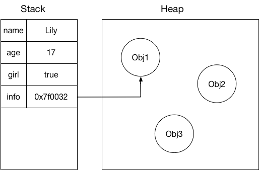
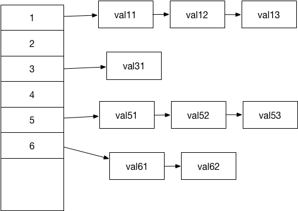

前端内存概述

### 内存结构

内存分为堆（heap）和栈（stack），堆内存存储复杂的数据类型，栈内存则存储简单数据类型，方便快速写入和读取数据。在访问数据时，先从栈内寻找相应数据的存储地址，再根据获得的地址，找到堆内该变量真正存储的内容读取出来。

在前端中，被存储在栈内的数据包括小数值型，string ，boolean 和复杂类型的地址索引。

所谓小数值数据(small number), 即长度短于 32 位存储空间的 number 型数据。

一些复杂的数据类型，诸如 Array，Object 等，是被存在堆中的。如果我们要获取一个已存储的对象 A，会先从栈中找到这个变量存储的地址，再根据该地址找到堆中相应的数据。如图：

简单的数据类型由于存储在栈中，读取写入速度相对复杂类型（存在堆中）会更快些。

Object 存储

哈希表

哈希表存储是一种常见的数据结构。所谓哈希映射，是把任意长度的输入通过散列算法变换成固定长度的输出。

对于一个 JS 对象，每一个属性，都按照一定的哈希映射规则，映射到不同的存储地址上。在我们寻找该属性时，也是通过这个映射方式，找到存储位置。当然，这个映射算法一定不能过于复杂，这会使映射效率低下；但也不能太简单，过于简单的映射方式，会导致无法将变量均匀的映射到一片连续的存储空间内，而造成频繁的哈希碰撞。

哈希碰撞

所谓哈希碰撞，指的是在经过哈希映射计算后，被映射到了相同的地址，这样就形成了哈希碰撞。想要解决哈希碰撞，则需要对同样被映射过来的新变量进行处理。

众所周知，JS 的对象是可变的，属性可在任意时候（大部分情况下）添加和删除。在最开始给一个对象分配内存时，如果不想出现哈希碰撞问题，则需要分配巨大的连续存储空间。但大部分的对象所包含的属性一般都不会很长，这就导致了极大的空间浪费。

但是如果一开始分配的内存较少，随着属性数量的增加，必定会出现哈希碰撞，那如何解决哈希碰撞问题呢？

对于哈希碰撞问题，比较经典的解决方法有如下几种：
- 开放寻址法
- 再哈希法
- 拉链法

在 JS 中，选择的是拉链法解决哈希碰撞。所谓拉链法，是将通过一定算法得到的相同映射地址的值，用链表的形式存储起来。如图所示（以倾斜的箭头表明链表动态分配，并非连续的内存空间）：

映射后的地址空间存储的是一个链表的指针，一个链表的每个单元，存储着该属性的 key, value 和下一个元素的指针；

这种存储的方式的好处是，最开始不需要分配较大的存储空间，新添加的属性只要动态分配内存即可；

Array 存储

Array 是一种特殊类型的对象。所谓特殊类型，就是指在 Array 中，每一个属性的 key 就是这个属性的 index；而这个对
象还有 .length 属性；还有 concat, slice, push, pop 等方法；这种特殊类型的对象可以针对操作带来极大的方便性。但数据量大的时候数组索引会遇到问题， 可以使用es6 的 ArrayBuffer来解决性能问题。

### web worker 共享内存机制

### 垃圾回收机制

JS 语言并不像诸如 C++ 一样需要手动分配内存和释放内存，而是有自己一套动态 GC 策略的。通常的垃圾回收机制有很多种。前端用到的方式为标记清除法，可以解决循环引用的问题。
https://developer.mozilla.org/zh-CN/docs/Web/JavaScript/Memory_Management
